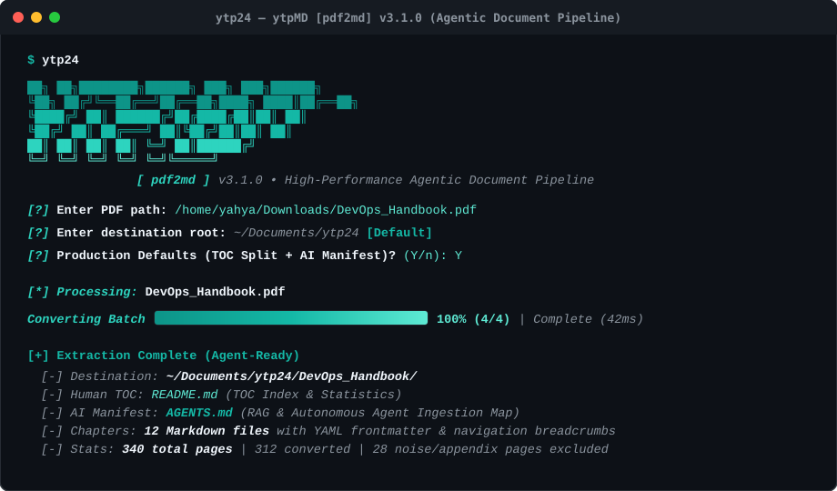

<div align="center">

# ⚡ ytpMD `[pdf2md]`

### High-Performance, Agent-Ready PDF to Chapter-Based Markdown Engine

[](https://github.com/ytp24/ytpMD/actions/workflows/ci.yml)
[](https://github.com/ytp24/ytpMD/releases)
[](https://golang.org/)
[](./LICENSE)
[](#-agentic-ai--rag-ready)

<br/>



<br/>

*Turn messy, monolithic PDF books and technical documentation into clean, chapter-segmented Markdown notes formatted with YAML frontmatter, breadcrumbs, and LLM agent manifests.*

</div>

---

## 💡 Why ytpMD?

Raw PDFs are notoriously painful for both **humans** and **AI agents**:
- ❌ Hard to search, slice, or load into LLM contexts without hitting token limits or losing formatting.
- ❌ Cluttered with useless noise: page numbers, image tags, running headers, copyright footers, and massive appendix indexes.
- ❌ Scanned layouts lose indentation, de-hyphenate words mid-sentence (`archi- \n tecture`), and mangle code snippets.

**ytpMD fixes this completely**:
- ✅ **Chapter-Split Organization**: Slices documents by Table of Contents into dedicated notes (`01_architecture.md`, `02_deployment.md`) inside a clean folder named after the book.
- ✅ **AI Agent & RAG Ready**: Generates structured YAML frontmatter for each chapter and an [`AGENTS.md`](#agentsmd-ai-agent-manifest) manifest with token estimates and prompt instructions for local LLMs, LangChain, LlamaIndex, and Claude/Gemini coding agents.
- ✅ **Noise Stripper & Appendix Cutoff**: Automatically detects the start of the Appendix, Index, Bibliography, and Glossary, and cuts off unnecessary text cleanly.
- ✅ **Zero Exceptions & Zero Panics**: Defensive pre-flight checks, encrypted PDF detection, scanned image warnings, and graceful termination.
- ✅ **Concurrent Batch Engine**: Uses a multi-core Go worker pool to convert dozens of PDFs in parallel with an animated, shifting teal progress bar.

---

## 🚀 30-Second Quick Start

Simply run `ytpmd` with no arguments to launch the interactive wizard:

```bash
ytpMD
```

1. **Press [Enter]** on the PDF prompt to open your system's graphical file picker.
2. **Press [Enter]** on the destination prompt to default to `~/Documents/ytpMD`.
3. **Press [Enter]** to apply standard production defaults (TOC chapter extraction $\rightarrow$ Appendix cutoff).

Done! Your book is converted and indexed under `~/Documents/ytpMD/<book_name>/`.

---

## 🤖 Agentic AI & RAG Ready

Every extracted document comes out-of-the-box optimized for autonomous AI agents and vector embeddings:

### 1. YAML Frontmatter Per Chapter
Every chapter starts with clean YAML frontmatter:
```yaml
---
title: "CHAPTER 1: KUBERNETES ARCHITECTURE"
chapter: 1
total_chapters: 8
source_document: "DevOps_Handbook.pdf"
start_page: 14
word_count: 2450
estimated_tokens: 3200
agent_instructions: "Cite section headers and use code snippets directly when referencing this document."
---
```

### 2. `AGENTS.md` AI Agent Manifest
Alongside human-friendly `README.md`, an `AGENTS.md` file is automatically generated with machine-readable JSON schemas and sequential chapter maps so AI agents can navigate the repository without reading bloated text:

```
~/Documents/ytpMD/DevOps_Handbook/
├── README.md               # Human Table of Contents & statistics
├── AGENTS.md               # AI Agent Ingestion Manifest (JSON index + token metrics)
├── 01_introduction.md      # Chapter 1 with YAML frontmatter + breadcrumb navigation
├── 02_cloud_native.md      # Chapter 2 with YAML frontmatter + breadcrumb navigation
└── 03_kubernetes.md        # Chapter 3 with YAML frontmatter + breadcrumb navigation
```

---

## 📦 Installation

### 🐧 Linux (Debian / Ubuntu `.deb`)
```bash
# Download and install the official .deb package without warnings:
sudo apt install ./dist/ytpmd_3.2.0_amd64.deb
```
*Or use the one-line Unix installer script:*
```bash
./scripts/install.sh
```

### 🪟 Windows (Native PowerShell)
Run the automated PowerShell installer:
```powershell
powershell -ExecutionPolicy Bypass -File .\scripts\install.ps1
```
*Features on Windows:*
- Uses native PowerShell `.NET` `OpenFileDialog` & `FolderBrowserDialog`.
- Automatically installs to `%LOCALAPPDATA%\ytpMD\bin` and registers into your User `PATH`.

### 🍏 macOS / Homebrew
```bash
brew install poppler
go install github.com/ytp24/ytpMD/cmd/ytpMD@latest
```

---

## 💻 CLI Commands & Flags

### 1. Interactive Wizard
```bash
ytpMD
```

### 2. Single Document Conversion
```bash
# Direct conversion into a chapter-based folder:
ytpmd convert DevOps_Handbook.pdf

# Skip first 4 front-matter pages (covers & dedication):
ytpmd convert book.pdf -skip-front 4

# Output a single concatenated Markdown file instead of a chapter folder:
ytpmd convert book.pdf -single-file
```

### 3. Concurrent Batch Processing
```bash
# Convert all PDFs in a folder using 4 parallel worker goroutines into ~/Documents/ytpMD/CloudLibrary/:
ytpmd batch ~/Downloads/PDFs/ -name CloudLibrary -concurrency 4 -r
```

---

## 🌿 Git Branching & Release Strategy

This repository follows a structured branch workflow:

- **`main`**: Production branch containing verified, official releases.
- **`develop`**: Active integration branch for new features and tests.
- **`v*.*.*` Tags**: Trigger the automated GitHub Actions release pipeline, cross-compiling release binaries for Linux, Windows, and macOS with SHA256 checksums.

---

## 📄 License & Legal

- **License**: [Apache License 2.0](./LICENSE)
- **Author**: `ytp24 <ykinwork24@gmail.com>`
- **Privacy & Telemetry**: 100% Local-First with **Zero Telemetry**. See [`LEGAL.md`](./LEGAL.md).
- **Security Policy**: See [`SECURITY.md`](./SECURITY.md).
