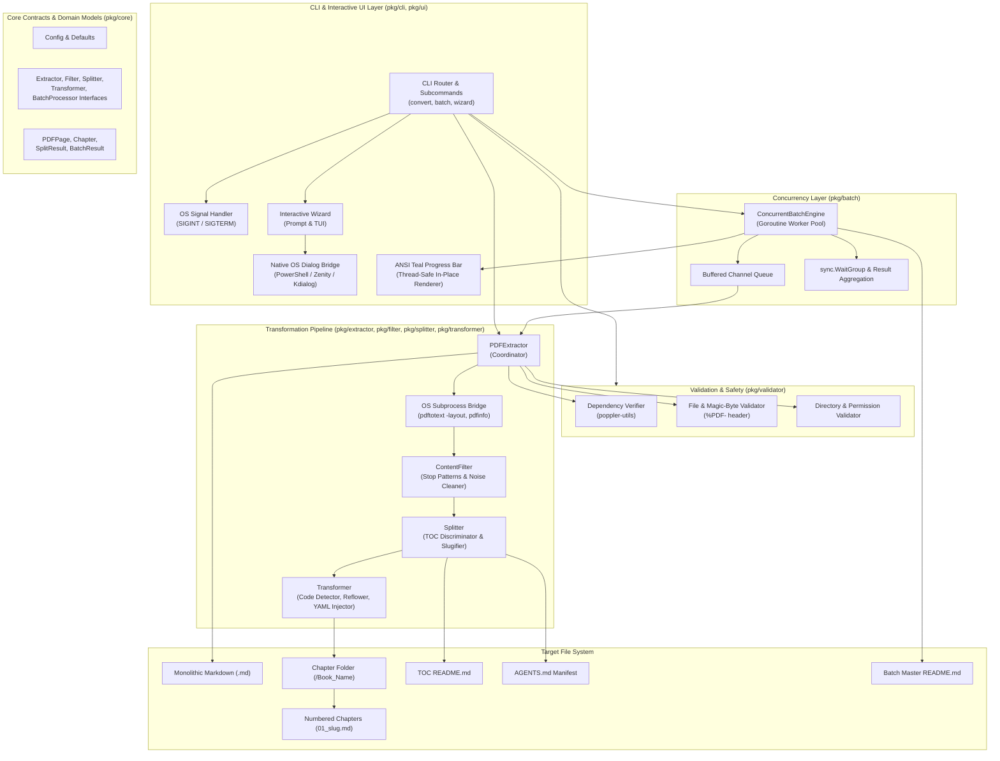
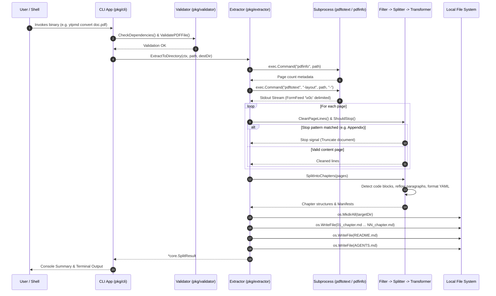
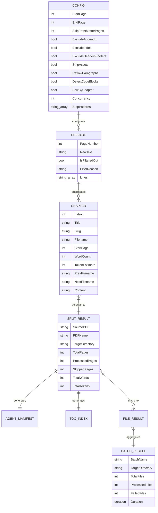
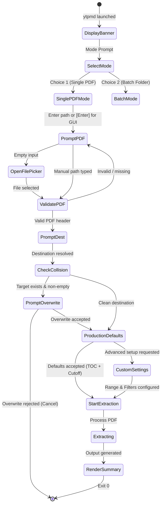
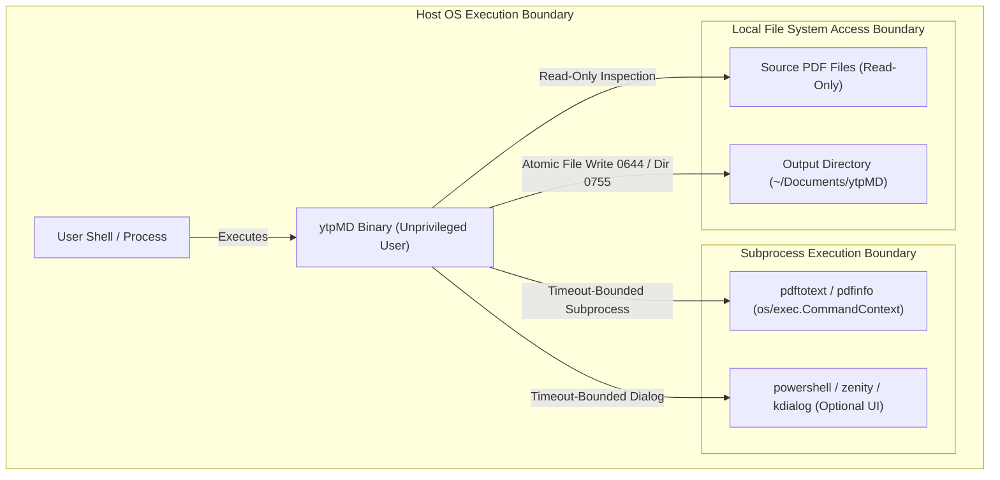
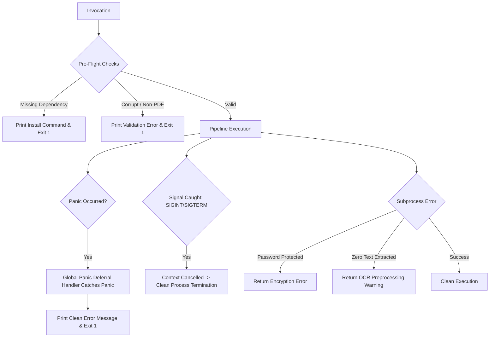
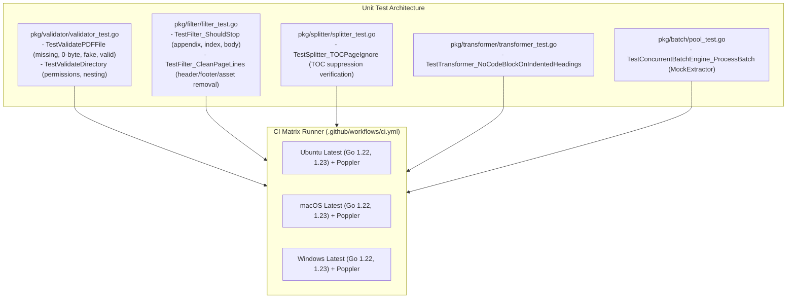
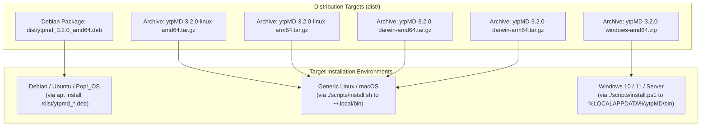
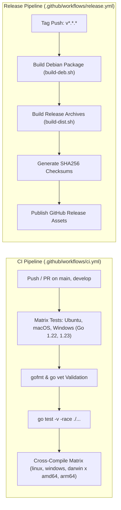

# ytpMD [pdf2md]

> Professional technical white paper

## Abstract

**ytpMD** (aliased across executable entry points as `pdf2md`, `ytp24`, and `ytpmd`) is a high-performance, local-first Command Line Interface (CLI) application and document transformation engine written in Go (version 1.22). The system addresses the structural mismatch between monolithic, visual-oriented Portable Document Format (PDF) files and the ingestion requirements of downstream Large Language Model (LLM) agents, Retrieval-Augmented Generation (RAG) pipelines, and human technical documentation systems. 

ytpMD establishes a multi-stage, zero-external-Go-dependency processing pipeline that coordinates OS-level process virtualization (via `poppler-utils`), heuristic noise filtering, Table of Contents (TOC) vs. body semantic discrimination, paragraph reflow with de-hyphenation, programming language code-block fence detection, and chapter splitting. Concurrently, it outputs structured GitHub-Flavored Markdown files accompanied by per-chapter YAML frontmatter, breadcrumb navigation, and an `AGENTS.md` machine-readable context manifest. This white paper presents a technical due-diligence analysis and architectural reconstruction based strictly on the verified source code, build manifests, CI/CD pipelines, and configuration artifacts present in the repository.

---

## 1. Executive Summary

### Purpose & Scope
Modern LLM architectures and automated reasoning agents require granular, noise-free, and semantically partitioned context windows. Standard PDF extraction approaches typically yield monolithic, unformatted text files laden with running headers, footers, page numbering artifacts, image tags, broken hyphenated line breaks, and trailing back-matter (indexes, bibliographies, and glossaries). ytpMD is designed to bridge this operational gap by deterministically converting raw technical books and documentation into clean, chapter-segmented Markdown directories.

### Primary Capabilities
- **Pre-Flight Validation**: Magic-byte PDF inspection (`%PDF-`), file emptiness detection, path canonicalization, and external dependency verification (`pdftotext`, `pdfinfo`).
- **Heuristic Noise & Back-Matter Stripping**: Regex-driven elimination of running headers/footers, page markers, inline asset tags (`[image: ...]`, `Figure ...`), and automatic truncation at the boundary of Appendices, Indexes, and Bibliographies.
- **TOC Discrimination & Chapter Splitting**: Multi-pass heading parser capable of separating TOC summary pages from actual content chapters to prevent duplicate fragment generation.
- **Agentic Metadata & Manifest Generation**: Dynamic computation of word counts, character-to-token estimations ($\approx \text{chars} / 3.8$), standardized YAML frontmatter, relative navigational breadcrumbs, and an `AGENTS.md` manifest containing a structured JSON schema.
- **Concurrent Worker Pool Engine**: Goroutine-backed batch processor with bounded channel queuing, thread-safe synchronization (`sync.WaitGroup`, `sync.Mutex`), and real-time ANSI terminal progress bars featuring a multi-shade teal gradient.
- **Cross-Platform Interactive UI**: Terminal wizard with non-blocking GUI file/directory picker fallbacks leveraging PowerShell `.NET` dialogs on Windows and `zenity`/`kdialog` on Unix systems with active `$DISPLAY`/`$WAYLAND_DISPLAY` environments.

### Deployment & Operation
ytpMD operates 100% offline with zero network connectivity and zero telemetry. It compiles to static CGO-free binaries for Linux, macOS, and Windows, distributed as standalone executables, cross-platform archives, and Debian `.deb` packages.

---

## 2. Software Identity

| Attribute | Value | Implementation Evidence |
| :--- | :--- | :--- |
| **Project Name** | ytpMD (`pdf2md`, `ytp24`, `ytpmd`) | [`go.mod`](file:///home/yahya/SHARED/Projects/ytpMD/go.mod), [`Makefile`](file:///home/yahya/SHARED/Projects/ytpMD/Makefile), [`pkg/cli/app.go`](file:///home/yahya/SHARED/Projects/ytpMD/pkg/cli/app.go) |
| **Version** | `3.2.0` | [`pkg/cli/app.go:L22`](file:///home/yahya/SHARED/Projects/ytpMD/pkg/cli/app.go#L22), [`scripts/build-deb.sh:L4`](file:///home/yahya/SHARED/Projects/ytpMD/scripts/build-deb.sh#L4), [`scripts/build-dist.sh:L4`](file:///home/yahya/SHARED/Projects/ytpMD/scripts/build-dist.sh#L4) |
| **Software Type** | CLI Developer Tool / Document Processing Engine | Source repository layout |
| **Primary Language** | Go (Golang) | `*.go` source files |
| **Language Standard** | Go 1.22 | [`go.mod:L3`](file:///home/yahya/SHARED/Projects/ytpMD/go.mod#L3), [`.github/workflows/ci.yml:L74`](file:///home/yahya/SHARED/Projects/ytpMD/.github/workflows/ci.yml#L74) |
| **External Go Deps** | None (Zero external module dependencies; Stdlib only) | [`go.mod`](file:///home/yahya/SHARED/Projects/ytpMD/go.mod) |
| **System Dependencies** | `poppler-utils` (`pdftotext`, `pdfinfo`); Optional: `zenity`, `kdialog`, `powershell` | [`pkg/validator/validator.go:L38-L45`](file:///home/yahya/SHARED/Projects/ytpMD/pkg/validator/validator.go#L38-L45), [`pkg/ui/dialog.go:L12-L142`](file:///home/yahya/SHARED/Projects/ytpMD/pkg/ui/dialog.go#L12-L142) |
| **License** | Apache License 2.0 | [`LICENSE`](file:///home/yahya/SHARED/Projects/ytpMD/LICENSE), [`LEGAL.md`](file:///home/yahya/SHARED/Projects/ytpMD/LEGAL.md) |
| **Repository URL** | `https://github.com/ytp24/ytpMD` | [`go.mod:L1`](file:///home/yahya/SHARED/Projects/ytpMD/go.mod#L1), [`README.md`](file:///home/yahya/SHARED/Projects/ytpMD/README.md) |
| **Supported Platforms**| Linux (`amd64`, `arm64`), Windows (`amd64`), macOS (`amd64`, `arm64`) | [`scripts/build-dist.sh:L10-L16`](file:///home/yahya/SHARED/Projects/ytpMD/scripts/build-dist.sh#L10-L16), [`.github/workflows/ci.yml`](file:///home/yahya/SHARED/Projects/ytpMD/.github/workflows/ci.yml) |
| **Implementation Status**| Completed, Production-Ready | Clean compilation, passing unit test suite, packaged distributions |

---

## 3. Problem Definition

### The Context
PDF is a 2D layout representation standard engineered for visual fidelity and hardware printing, not structured semantic comprehension. In technical manuals, reference texts, and computer science literature, content is divided across fixed-dimension pages.

### Key Pain Points Established by the Codebase
1. **Semantic Fragmentation**: Documents are arranged linearly without intrinsic demarcations separating chapters into modular context units.
2. **Context Window Contamination**: Header strings (e.g., `"Page 12 of 450"`, `"Confidential"`), copyright boilerplate, image replacement markers (`[image: logo.png]`), and non-printable control characters consume tokens and degrade retrieval accuracy in RAG vector stores.
3. **Lexical Mangling**: End-of-line word breaks in two-column or justified PDF layouts insert hard breaks and hyphens (`"archi-" \n "tecture"`), corrupting keyword embeddings and token matching.
4. **Trailing Deadweight**: Indexes, bibliographies, and glossaries contain high-density keyword lists without prose context, causing false-positive semantic matches in vector retrievals.
5. **Lack of Agent Navigation**: Standard text extractions lack file-to-file navigational references and token sizing parameters necessary for autonomous subagent planning.

---

## 4. Goals and Non-Goals

### Goals (Implemented)
- **Deterministic Transformation**: Provide predictable mapping from arbitrary PDF documents to clean Markdown without relying on remote SaaS APIs or stochastic foundation models.
- **Zero-Dependency Architecture**: Compile to single, self-contained binary distributions without requiring external Go module runtimes or dynamic C-bindings (`CGO_ENABLED=0`).
- **Autonomous RAG Readiness**: Generate complete YAML frontmatter headers, navigation breadcrumbs, and `AGENTS.md` context manifests.
- **Defensive Error Handling**: Ensure zero panics during unreadable, corrupted, encrypted, or 0-byte PDF parsing via pre-flight checks and global recovery deferrals.
- **Multi-Core Concurrency**: Enable parallel extraction of document batches using a worker pool with thread-safe UI rendering and cancellation via Go contexts.

### Non-Goals (Explicitly Excluded or Unsupported)
- **Integrated OCR Engine**: The software explicitly does not bundle an embedded Optical Character Recognition (OCR) engine (e.g., Tesseract). Scanned PDFs with fewer than 10 extracted text characters are caught defensively, returning a clear error prompting upstream OCR preprocessing ([`pkg/extractor/extractor.go:L117-L119`](file:///home/yahya/SHARED/Projects/ytpMD/pkg/extractor/extractor.go#L117-L119)).
- **PDF Mutation/Generation**: The software is strictly an extraction engine; it does not edit, sign, encrypt, or render PDFs.
- **Telemetry & Cloud Synchronization**: The application contains no network client routines, telemetry hooks, or remote analytics endpoints ([`LEGAL.md:L14-L19`](file:///home/yahya/SHARED/Projects/ytpMD/LEGAL.md#L14-L19)).

---

## 5. Product Capabilities

| Capability | Implementation | Evidence | Status |
| :--- | :--- | :--- | :--- |
| **PDF Header Verification** | Magic byte checking for `%PDF-` prefix in first 1024 bytes | [`pkg/validator/validator.go:L67-L84`](file:///home/yahya/SHARED/Projects/ytpMD/pkg/validator/validator.go#L67-L84) | **Implemented** |
| **Dependency Checking** | Process lookup (`exec.LookPath`) for `pdftotext` | [`pkg/validator/validator.go:L38-L45`](file:///home/yahya/SHARED/Projects/ytpMD/pkg/validator/validator.go#L38-L45) | **Implemented** |
| **Back-Matter Exclusion** | Regex stop-patterns matching `Appendix`, `Index`, `Bibliography`, `Glossary` | [`pkg/filter/filter.go:L41-L66`](file:///home/yahya/SHARED/Projects/ytpMD/pkg/filter/filter.go#L41-L66) | **Implemented** |
| **Noise Filtering** | Strips headers/footers, page counts, non-printable control chars, and `[image: ...]` | [`pkg/filter/filter.go:L68-L108`](file:///home/yahya/SHARED/Projects/ytpMD/pkg/filter/filter.go#L68-L108) | **Implemented** |
| **TOC Semantic Discrimination** | Density heuristic (`headers >= 2`) detecting TOC pages to ignore duplicate chapter triggers | [`pkg/splitter/splitter.go:L42-L51`](file:///home/yahya/SHARED/Projects/ytpMD/pkg/splitter/splitter.go#L42-L51) | **Implemented** |
| **Stub Merging & Cleanup** | Merges fragments $<20$ words into predecessor; drops intro stubs $<30$ words | [`pkg/splitter/splitter.go:L113-L134`](file:///home/yahya/SHARED/Projects/ytpMD/pkg/splitter/splitter.go#L113-L134) | **Implemented** |
| **Code Block Detection** | Language regex classifier for `go`, `python`, `yaml`, `json`, `bash` | [`pkg/transformer/transformer.go:L99-L160`](file:///home/yahya/SHARED/Projects/ytpMD/pkg/transformer/transformer.go#L99-L160) | **Implemented** |
| **De-Hyphenation & Reflow** | Reconnects trailing hyphens across hard breaks into unified paragraphs | [`pkg/transformer/transformer.go:L301-L318`](file:///home/yahya/SHARED/Projects/ytpMD/pkg/transformer/transformer.go#L301-L318) | **Implemented** |
| **YAML Metadata Header** | Injects structured YAML frontmatter per chapter note | [`pkg/transformer/transformer.go:L60-L72`](file:///home/yahya/SHARED/Projects/ytpMD/pkg/transformer/transformer.go#L60-L72) | **Implemented** |
| **Agent Manifest Generation** | Generates `AGENTS.md` containing machine-readable JSON context schema | [`pkg/splitter/splitter.go:L214-L279`](file:///home/yahya/SHARED/Projects/ytpMD/pkg/splitter/splitter.go#L214-L279) | **Implemented** |
| **Master TOC Index** | Generates human-facing `README.md` with chapter links and statistics | [`pkg/splitter/splitter.go:L176-L212`](file:///home/yahya/SHARED/Projects/ytpMD/pkg/splitter/splitter.go#L176-L212) | **Implemented** |
| **Concurrent Batch Pool** | Worker goroutines processing document queue with `sync.WaitGroup` | [`pkg/batch/pool.go:L27-L150`](file:///home/yahya/SHARED/Projects/ytpMD/pkg/batch/pool.go#L27-L150) | **Implemented** |
| **ANSI Gradient Progress Bar** | In-place terminal refresh with 5-stage 24-bit TrueColor teal palette | [`pkg/ui/progressbar.go:L10-L114`](file:///home/yahya/SHARED/Projects/ytpMD/pkg/ui/progressbar.go#L10-L114) | **Implemented** |
| **Native GUI Dialog Integration** | PowerShell `.NET` dialogs (Windows) and `zenity`/`kdialog` (Linux) | [`pkg/ui/dialog.go:L12-L142`](file:///home/yahya/SHARED/Projects/ytpMD/pkg/ui/dialog.go#L12-L142) | **Implemented** |
| **Graceful Interruption** | Signal interception (`os.Interrupt`, `syscall.SIGTERM`) with context cancel | [`pkg/cli/app.go:L36-L48`](file:///home/yahya/SHARED/Projects/ytpMD/pkg/cli/app.go#L36-L48) | **Implemented** |

---

## 6. System Architecture

ytpMD adheres to a clean, decoupled modular pipeline architecture. The execution layer isolates command dispatch and UI prompts from core transformation interfaces.



---

## 7. Component Architecture

### 1. `pkg/core`
- **Responsibility**: Houses domain structures ([`Config`](file:///home/yahya/SHARED/Projects/ytpMD/pkg/core/models.go), [`Chapter`](file:///home/yahya/SHARED/Projects/ytpMD/pkg/core/models.go), [`PDFPage`](file:///home/yahya/SHARED/Projects/ytpMD/pkg/core/models.go), [`SplitResult`](file:///home/yahya/SHARED/Projects/ytpMD/pkg/core/models.go), [`BatchResult`](file:///home/yahya/SHARED/Projects/ytpMD/pkg/core/models.go)) and abstract interface definitions ([`Extractor`](file:///home/yahya/SHARED/Projects/ytpMD/pkg/core/interfaces.go), [`Filter`](file:///home/yahya/SHARED/Projects/ytpMD/pkg/core/interfaces.go), [`Transformer`](file:///home/yahya/SHARED/Projects/ytpMD/pkg/core/interfaces.go), [`Splitter`](file:///home/yahya/SHARED/Projects/ytpMD/pkg/core/interfaces.go), [`BatchProcessor`](file:///home/yahya/SHARED/Projects/ytpMD/pkg/core/interfaces.go)).
- **State**: Stateless contracts; default configuration factory [`DefaultConfig()`](file:///home/yahya/SHARED/Projects/ytpMD/pkg/core/models.go).

### 2. `pkg/validator`
- **Responsibility**: System sanity and file integrity validation.
- **Inputs**: Path strings.
- **Outputs**: Clean absolute paths (`ExpandPath`), error status.
- **Internal Mechanisms**:
  - `ExpandPath`: Resolves `~` to user home directory using `os/user.Current()` and normalizes paths via `filepath.Abs` and `filepath.Clean`.
  - `CheckDependencies`: Queries OS `$PATH` for `pdftotext` via `exec.LookPath`.
  - `ValidatePDFFile`: Inspects `os.Stat`, rejects directories and 0-byte files, and reads the first 1024 bytes seeking `%PDF-`.
  - `ValidateDirectory`: Verifies directory existence or creates it (`0755`), performing a dynamic write probe via `.pdf2md_write_test`.

### 3. `pkg/extractor`
- **Responsibility**: Orchestration of PDF extraction pipeline via external sub-processes.
- **Inputs**: File paths, base target directories, `context.Context`.
- **Outputs**: `*core.SplitResult` or `*core.ProcessedDocument`.
- **Failure Behavior**: Defers a panic recovery function returning wrapped internal errors; inspects subprocess `stderr` for encryption and corruption indicators; checks total extracted character volume ($<10$ characters triggers a scanned-image OCR warning).

```go
// Representative extraction execution from pkg/extractor/extractor.go
func (e *PDFExtractor) extractPages(ctx context.Context, pdfPath string) ([]core.PDFPage, error) {
	if err := validator.CheckDependencies(); err != nil {
		return nil, err
	}

	reqCtx, cancel := context.WithTimeout(ctx, 60*time.Second)
	defer cancel()

	cmd := exec.CommandContext(reqCtx, "pdftotext", "-layout", pdfPath, "-")
	var stdout, stderr bytes.Buffer
	cmd.Stdout = &stdout
	cmd.Stderr = &stderr

	if err := cmd.Run(); err != nil {
		errMsg := strings.ToLower(stderr.String())
		if strings.Contains(errMsg, "encrypted") || strings.Contains(errMsg, "password") {
			return nil, fmt.Errorf("PDF is encrypted or password-protected: %s", filepath.Base(pdfPath))
		}
		if strings.Contains(errMsg, "syntax error") || strings.Contains(errMsg, "corrupt") {
			return nil, fmt.Errorf("PDF file appears to be corrupted or invalid: %s", filepath.Base(pdfPath))
		}
		return nil, fmt.Errorf("failed to process PDF: %s (%s)", err, strings.TrimSpace(stderr.String()))
	}

	rawPages := strings.Split(stdout.String(), "\x0c") // Split on FormFeed byte
    // ...
```

### 4. `pkg/filter`
- **Responsibility**: Content pruning, stop-pattern detection, and non-printable character eradication.
- **Regex Rules**:
  - Stop patterns: `(?i)^appendix\s+[a-z0-9]`, `(?i)^appendices\b`, `(?i)^index\b`, `(?i)^subject\s+index\b`, `(?i)^author\s+index\b`, `(?i)^bibliography\b`, `(?i)^references\b`, `(?i)^glossary\b`.
  - Headers/Footers: `(?i)^page\s+\d+(\s+of\s+\d+)?$`, `^\d+\s*[/|]\s*\d+$`, `^[—–-]\s*\d+\s*[—–-]$`, `^\d{1,4}$`, `(?i)^(copyright|all rights reserved|confidential)\b`.
  - Asset tags: `(?i)\[image:[^\]]*\]`, `(?i)\bFigure\s+\d+([.:].*)?$`.
  - Non-printable bytes: `[\x00-\x08\x0B\x0C\x0E-\x1F\x7F]`.

### 5. `pkg/splitter`
- **Responsibility**: Chapter boundary detection, Table of Contents suppression, slug generation, and manifest formatting.
- **Algorithms**:
  - Two-pass TOC identification: Counts occurrences of `chapterHeaderPattern` and `tocLeaderPattern` on a page. If count $\ge 2$, `isTOCPage = true`, preventing false-positive chapter splits.
  - Slugification: Strips prefixes (`Chapter 1:`), normalizes non-alphanumerics to underscores, limits word length to 6 tokens.
  - Fragmentation cleanup: Stubs with $<30$ words at start are discarded; sub-20-word fragments are merged into previous chapters.

### 6. `pkg/transformer`
- **Responsibility**: Markdown syntax synthesis, code-block fence classification, and paragraph reflow.
- **Fencing Heuristics**: Detects Go, Python, YAML, JSON, and Bash syntax patterns while preventing headers (`# ...`) from being trapped within code fences.
- **Reflow Engine**: Joins hard-wrapped lines into unified paragraphs, automatically reattaching split words ending in trailing hyphens (`-`).

### 7. `pkg/batch`
- **Responsibility**: Multi-document concurrent processing.
- **Concurrency Model**: Worker pool with fixed goroutines ($N = \text{concurrency}$, default 4, bounds $[2, 8]$ if auto-detected via `runtime.NumCPU()`). Aggregates outcomes and generates a master batch index `README.md`.

### 8. `pkg/ui`
- **Responsibility**: User interaction, banner presentation, overwrite confirmation, and visual feedback.
- **Sub-modules**:
  - `dialog.go`: Native OS GUI dialog spawning.
  - `progressbar.go`: Thread-safe, ANSI-escaped terminal progress bar with shifting teal palette.
  - `prompt.go`: Command-line wizard and terminal styling constants.

---

## 8. Runtime Architecture

The execution of ytpMD occurs strictly within a local process boundary, managing memory allocations and spawning ephemeral child processes for Poppler utilities.



---

## 9. Data Architecture

The application handles ephemeral in-memory domain models during transformation and persists structured file hierarchies to disk.

### Domain Entity Relationships



### Output File System Schema

```text
<DestinationRoot>/<DocumentBaseName>/
├── README.md               # Human Table of Contents & Extraction Statistics
├── AGENTS.md               # AI Agent Manifest with JSON Schema & Navigation Map
├── 01_<chapter_slug>.md    # Chapter 1 with YAML frontmatter and breadcrumbs
├── 02_<chapter_slug>.md    # Chapter 2 with YAML frontmatter and breadcrumbs
└── NN_<chapter_slug>.md    # Chapter N with YAML frontmatter and breadcrumbs
```

---

## 10. Data Flow


---

## 11. Core Algorithms and Business Logic

### 1. Table of Contents vs. Body Chapter Discrimination
A primary challenge in document segmentation is preventing TOC index pages from triggering false chapter files. ytpMD implements a density heuristic in [`pkg/splitter/splitter.go:L42-L51`](file:///home/yahya/SHARED/Projects/ytpMD/pkg/splitter/splitter.go#L42-L51):
- A regular expression scans page lines for chapter headers (`(?i)^(CHAPTER\s+\d+|PART\s+[IVXLCDM]+|MODULE\s+\d+)[:.]?\s*(.*)$`) and TOC leader patterns (`(?i)^(chapter\s+\d+|part\s+[ivxlcdm]+).*[\.\s_–-]{3,}\s*\d+$`).
- If two or more matching headers occur on a single page, the entire page is flagged as `isTOCPage = true`.
- While `isTOCPage` is true, header lines are treated as body content rather than chapter boundaries, preventing the generation of empty chapter stubs.

### 2. Lexical Paragraph Reflow & De-Hyphenation
In [`pkg/transformer/transformer.go:L301-L318`](file:///home/yahya/SHARED/Projects/ytpMD/pkg/transformer/transformer.go#L301-L318), the transformer reassembles fragmented terminal lines into cohesive Markdown paragraphs:

```go
// Representative joining logic from pkg/transformer/transformer.go
func (t *Transformer) joinLines(lines []string) string {
	var sb strings.Builder
	for i, l := range lines {
		if i == 0 {
			sb.WriteString(l)
		} else {
			curr := sb.String()
			if strings.HasSuffix(curr, "-") && !strings.HasSuffix(curr, " -") {
				trimmed := strings.TrimSuffix(curr, "-")
				sb.Reset()
				sb.WriteString(trimmed + l) // Reconnect de-hyphenated words
			} else {
				sb.WriteString(" " + l)     // Reflow line break into space
			}
		}
	}
	return sb.String()
}
```

### 3. Syntax-Aware Code Block Fencing
The transformer scans content line-by-line using regular expressions to detect programming constructs:
- **Go**: `^\s*(package\s+\w+|import\s+\(|func\s+\w+|type\s+\w+\s+struct)`
- **Python**: `^\s*(def\s+\w+\(|import\s+[\w.]+|class\s+\w+[:(]|from\s+\w+\s+import)`
- **YAML**: `^\s*(apiVersion:\s*[\w./]+|kind:\s+[A-Z]\w+|spec:\s*$)`
- **JSON**: `^\s*(\{\s*"|"[\w_-]+":\s*["{\[\d])`
- **Bash**: `^\s*(\$\s+|#!\/bin\/|sudo\s+|kubectl\s+|docker\s+|terraform\s+|ansible\s+|helm\s+|git\s+|aws\s+|az\s+|curl\s+|npm\s+|pip\s+)`

Lines beginning with Markdown headers (`#`) explicitly terminate any active code block state to prevent document corruption.

### 4. Algorithmic Complexity Derivations
- **Validation**: $\mathcal{O}(1)$ time and space (constant 1024-byte header slice).
- **Text Cleaning & Filtering**: $\mathcal{O}(N)$ where $N$ is total lines of text. Regex matches are executed against pre-compiled expressions.
- **Chapter Splitting**: $\mathcal{O}(N)$ single-pass evaluation across extracted page lines.
- **Overall Memory Complexity**: $\mathcal{O}(M)$ where $M$ is the uncompressed text size of the PDF document held in memory during the transformation pipeline.

---

## 12. API / Interface Specification

### CLI Surface & Command Dispatch
The CLI provides subcommands and POSIX/GNU-style flags routed in [`pkg/cli/app.go`](file:///home/yahya/SHARED/Projects/ytpMD/pkg/cli/app.go#L62-L91).

```text
ytpmd [command] [options] [arguments]
```

#### Primary Commands

| Command | Arguments | Description |
| :--- | :--- | :--- |
| `ytpmd` (no args) | None | Launches interactive configuration wizard with native dialog pickers |
| `ytpmd convert` | `<input.pdf>` | Converts a single PDF document into a chapter folder or file |
| `ytpmd batch` | `<directory>` | Processes all PDFs within a directory concurrently using worker goroutines |
| `ytpmd help` / `-h` | None | Displays help screen and available command flags |
| `ytpmd version` / `-v` | None | Displays version string (`3.2.0`) and Go compiler version |

#### Command-Line Flags

| Flag | Type | Default | Scope | Description |
| :--- | :--- | :--- | :--- | :--- |
| `-o`, `-output` | string | `~/Documents/ytpMD` | `convert`, `batch` | Root directory for extracted Markdown storage |
| `-name` | string | `filepath.Base(dir)` | `batch` | Target subfolder name for batch storage |
| `-f`, `-force`, `-overwrite` | bool | `false` | `convert`, `batch` | Overwrite existing destination folder without prompt |
| `-concurrency` | int | `4` | `batch` | Number of concurrent worker goroutines |
| `-skip-front` | int | `0` | `convert`, `batch` | Skip the first $N$ pages (covers, front-matter) |
| `-start-page` | int | `1` | `convert` | Starting page number for extraction |
| `-end-page` | int | `0` (until end) | `convert` | Ending page number for extraction |
| `-keep-appendix` | bool | `false` | `convert`, `batch` | Disables automatic Appendix, Index, and Bibliography filtering |
| `-single-file` | bool | `false` | `convert` | Outputs a single concatenated `.md` file instead of chapter folder |
| `-no-reflow` | bool | `false` | `convert` | Disables paragraph reflow and de-hyphenation |
| `-r`, `-recursive` | bool | `false` | `batch` | Recursively searches subdirectories for `.pdf` files |

#### Exit Codes
- `0`: Successful execution or clean user-initiated cancellation (SIGINT/SIGTERM).
- `1`: Validation error, missing dependency, invalid arguments, or internal processing failure.

---

## 13. User Experience and Workflows

### Interactive Terminal Wizard Workflow
When executed without arguments, ytpMD initiates an interactive terminal session with ANSI colorization and native GUI dialog bridges.



---

## 14. Security Architecture

### Security Posture & Principles
ytpMD is engineered as an offline, single-user developer tool. It requires no elevated privileges and makes no network connections.



### Implemented Security Controls
1. **Zero Network Exposure**: No HTTP listeners, sockets, or telemetry clients exist in the codebase.
2. **Subprocess Timeout Guards**: All subprocess invocations enforce strict `context.WithTimeout` boundaries (10s for `pdfinfo`, 60s for `pdftotext`, 120s for GUI pickers) preventing resource exhaustion from hanging child processes.
3. **Magic-Byte Format Verification**: Verifies `%PDF-` binary signatures prior to invoking system parser utilities, preventing malicious shell execution on arbitrary file types.
4. **Restricted File Permissions**: Directory creation uses `0755` permissions; generated files use `0644`.
5. **No Static Secrets**: Zero embedded API tokens, passwords, private keys, or certificates exist in the code.

### Security Assumptions and Gaps
- **Parser Vulnerabilities in Poppler**: The software relies on the system-installed `pdftotext` binary. Vulnerabilities in `libpoppler` (e.g., buffer overflows in corrupted font rendering) represent a potential attack surface if processing untrusted, hostile PDF binaries.
- **Path Traversal via PDF Naming**: Document titles and slugs are filtered through `sanitizeSlug`, which strips non-alphanumerics and traversal characters (`/`, `\`, `:`), mitigating path traversal risks when creating subdirectories.

---

## 15. Reliability and Failure Handling

### Defensive Failure Handlers



### Failure Path Mapping
- **Global Panic Interception**: Both the entry-point router ([`pkg/cli/app.go:L27-L34`](file:///home/yahya/SHARED/Projects/ytpMD/pkg/cli/app.go#L27-L34)) and individual extraction routines ([`pkg/extractor/extractor.go:L41-L45`](file:///home/yahya/SHARED/Projects/ytpMD/pkg/extractor/extractor.go#L41-L45)) wrap execution in deferred recovery blocks, converting panics into structured Go `error` returns.
- **Graceful Signal Handling**: A dedicated goroutine intercepts `os.Interrupt` and `syscall.SIGTERM`, triggering context cancellation across all active child processes and worker goroutines before terminating cleanly with exit code `0`.
- **Encrypted Document Detection**: Captures `stderr` output from `pdftotext` to classify password-protected documents cleanly without crashing.

---

## 16. Performance Characteristics

### Empirical Evidence & Implementation Mechanics
- **Direct Subprocess Piping**: Extractions stream standard output directly from `pdftotext` into in-memory byte buffers via `bytes.Buffer`, avoiding disk I/O bottlenecks during intermediate transformations.
- **Single-Allocation String Builders**: Markdown document and manifest rendering utilizes `strings.Builder` across the transformer and splitter modules to minimize garbage collection overhead.
- **In-Place ANSI Rendering**: The progress bar updates the terminal using carriage return (`\r`) and line-clear escape sequences (`\033[2K`), avoiding terminal scrolling overhead during multi-file processing.

> **Performance Benchmarks Statement**: Performance characteristics (such as conversion throughput in pages/second across hardware tiers) have not been empirically benchmarked by automated performance tests in the repository.

---

## 17. Scalability

### Implemented Scalability Model
ytpMD implements **vertical multi-core scaling** for batch operations using a Go worker pool pattern:

```go
// Representative worker pool implementation from pkg/batch/pool.go
func (b *ConcurrentBatchEngine) ProcessBatch(...) (*core.BatchResult, error) {
    // ...
    jobs := make(chan job, totalFiles)
    resultsChan := make(chan core.FileResult, totalFiles)
    var wg sync.WaitGroup

    for w := 0; w < concurrency; w++ {
        wg.Add(1)
        go func() {
            defer wg.Done()
            for j := range jobs {
                select {
                case <-ctx.Done():
                    return
                default:
                }
                splitRes, err := b.extractor.ExtractToDirectory(ctx, j.path, batchTargetDir)
                // ...
            }
        }()
    }
    // ...
```

### Scalability Limits
- **Single Document Limit**: A single monolithic PDF is processed sequentially by page; chapter splitting occurs after page extraction completes.
- **Memory Scaling**: Large PDFs are loaded into memory as page-split strings. Processing extremely large PDF files ($\ge 2000$ pages) scales memory consumption linearly with raw text size.

---

## 18. Testing Strategy

The repository includes a comprehensive unit test suite written in standard Go testing packages, executed across platforms in CI.



### Test Evidence Table

| Test Function | Test File | Target Under Test | Verification Focus |
| :--- | :--- | :--- | :--- |
| `TestValidatePDFFile` | [`pkg/validator/validator_test.go:L9`](file:///home/yahya/SHARED/Projects/ytpMD/pkg/validator/validator_test.go#L9) | `ValidatePDFFile` | Rejection of non-existent, 0-byte, and non-PDF files; acceptance of `%PDF-` header |
| `TestValidateDirectory` | [`pkg/validator/validator_test.go:L43`](file:///home/yahya/SHARED/Projects/ytpMD/pkg/validator/validator_test.go#L43) | `ValidateDirectory` | Existing directory validation and automatic creation of nested directories |
| `TestFilter_ShouldStop` | [`pkg/filter/filter_test.go:L10`](file:///home/yahya/SHARED/Projects/ytpMD/pkg/filter/filter_test.go#L10) | `ContentFilter.ShouldStop` | Verification of cutoff on `APPENDIX A` and `INDEX`; continuation on `CHAPTER 1` |
| `TestFilter_CleanPageLines` | [`pkg/filter/filter_test.go:L36`](file:///home/yahya/SHARED/Projects/ytpMD/pkg/filter/filter_test.go#L36) | `ContentFilter.CleanPageLines` | Removal of page markers, copyright strings, and `[image: ...]` placeholders |
| `TestSplitter_TOCPageIgnore` | [`pkg/splitter/splitter_test.go:L9`](file:///home/yahya/SHARED/Projects/ytpMD/pkg/splitter/splitter_test.go#L9) | `Splitter.SplitIntoChapters` | Confirmation that multi-header TOC pages do not spawn spurious chapter stubs |
| `TestTransformer_NoCodeBlockOnIndentedHeadings` | [`pkg/transformer/transformer_test.go:L10`](file:///home/yahya/SHARED/Projects/ytpMD/pkg/transformer/transformer_test.go#L10) | `Transformer.Transform` | Verifies indented headings are not wrapped in code blocks; verifies shell commands are |
| `TestConcurrentBatchEngine_ProcessBatch` | [`pkg/batch/pool_test.go:L48`](file:///home/yahya/SHARED/Projects/ytpMD/pkg/batch/pool_test.go#L48) | `ConcurrentBatchEngine.ProcessBatch` | Multi-goroutine worker execution using `MockExtractor`, error counting, master `README.md` |

---

## 19. Build and Dependency Architecture

### Dependency Manifest
The application maintains **zero third-party Go dependencies**, compiling purely against the Go Standard Library.

```text
// go.mod
module github.com/ytp24/ytpMD

go 1.22
```

### Build Pipeline Targets (`Makefile`)
- `make all`: Formats code (`go fmt`), executes tests (`go test -v ./...`), and compiles binaries.
- `make build`: Produces static binaries under `bin/` with stripped symbol tables and debug information (`-ldflags="-s -w"`), generating aliases: `bin/ytpmd`, `bin/ytpMD`, `bin/ytp24`, `bin/pdf2md`.
- `make install`: Copies binary and aliases to `$(HOME)/.local/bin`.
- `make deb`: Invokes [`scripts/build-deb.sh`](file:///home/yahya/SHARED/Projects/ytpMD/scripts/build-deb.sh) to generate a Debian package using `dpkg-deb`.
- `make dist`: Invokes [`scripts/build-dist.sh`](file:///home/yahya/SHARED/Projects/ytpMD/scripts/build-dist.sh) to cross-compile distribution `.tar.gz` and `.zip` archives.

---

## 20. Deployment Architecture



---

## 21. Configuration and Environment Management

Configuration is managed via structural defaults in [`pkg/core/models.go`](file:///home/yahya/SHARED/Projects/ytpMD/pkg/core/models.go#L29-L57), overridden dynamically by CLI flags or the interactive wizard.

### Environment Variable Interactions

| Environment Variable | Source Path | Purpose | Behavior if Unset |
| :--- | :--- | :--- | :--- |
| `HOME` | [`pkg/validator/validator.go:L24`](file:///home/yahya/SHARED/Projects/ytpMD/pkg/validator/validator.go#L24) | Tilde expansion (`~`) | Falls back to system user directory |
| `DISPLAY` | [`pkg/ui/dialog.go:L41`](file:///home/yahya/SHARED/Projects/ytpMD/pkg/ui/dialog.go#L41) | X11 GUI presence check | Suppresses `zenity`/`kdialog` fallback on headless servers |
| `WAYLAND_DISPLAY` | [`pkg/ui/dialog.go:L41`](file:///home/yahya/SHARED/Projects/ytpMD/pkg/ui/dialog.go#L41) | Wayland GUI presence check | Suppresses `zenity`/`kdialog` fallback on headless servers |
| `LOCALAPPDATA` | [`scripts/install.ps1:L4`](file:///home/yahya/SHARED/Projects/ytpMD/scripts/install.ps1#L4) | Windows installation path | Defaults to `$env:LOCALAPPDATA\ytpMD\bin` |

---

## 22. Observability and Operations

### Terminal Observability Mechanisms
- **Real-Time ANSI Color Feedback**: Uses TrueColor palette codes for operational status (Teal for progress, Yellow for warnings/cancellations, Red for errors).
- **Progress Tracking**: Concurrent batch execution reports progress dynamically via [`ProgressBar`](file:///home/yahya/SHARED/Projects/ytpMD/pkg/ui/progressbar.go#L12-L19) showing percentage, file counts, and truncated active filename.
- **Batch Processing Summaries**: Reports total execution duration, succeeded/failed file counts, and failure reasons per file upon batch completion.

---

## 23. CI/CD and Release Engineering

### Workflows Defined in `.github/workflows/`



---

## 24. Operational Runbook

### Installation & Execution Procedures

#### 1. Debian/Ubuntu Package Installation
```bash
# Install the generated .deb package
sudo apt install ./dist/ytpmd_3.2.0_amd64.deb

# Verify installation
ytpmd version
```

#### 2. Unix Source Build & Install
```bash
# Ensure poppler-utils is installed
sudo apt install poppler-utils # Debian/Ubuntu
brew install poppler           # macOS

# Build and install to ~/.local/bin
make install
```

#### 3. Single PDF Conversion
```bash
# Interactive mode
ytpmd

# Direct CLI conversion with forced overwrite
ytpmd convert /path/to/handbook.pdf -o ~/Documents/ytpMD -force
```

#### 4. Batch Concurrent Processing
```bash
# Convert an entire directory of PDFs using 6 worker goroutines
ytpmd batch ~/Downloads/PDF_Library/ -name CloudDocs -concurrency 6 -r
```

---

## 25. Threat Model

| Asset / Boundary | Threat Actor | Vector | Impact | Implemented Mitigation | Residual Risk |
| :--- | :--- | :--- | :--- | :--- | :--- |
| **Local File System** | Local User / Malware | Malicious input file path traversing directory trees | Arbitrary file overwrite | `sanitizeSlug` and `filepath.Abs` path canonicalization | Output directory must be user-writable |
| **System Parser Subprocess** | Malicious PDF Document | Exploitation of vulnerabilities in `pdftotext` (Poppler) | Process crash / Memory corruption in child process | Ephemeral subprocess isolation; `context.WithTimeout` execution boundary | Zero-day vulnerabilities in host `libpoppler` library |
| **Resource Depletion** | Pathological / Massive PDF | Subprocess hang or unbounded CPU spinning | CLI freezing indefinitely | 60-second context timeout on `pdftotext`; 10-second timeout on `pdfinfo` | High CPU usage during intensive PDF parsing |
| **UI Hijacking** | Remote SSH Session | Inadvertent spawning of GUI file dialogs | CLI freeze awaiting X11 server | Explicit check for `$DISPLAY` and `$WAYLAND_DISPLAY` prior to GUI execution | Native dialogs depend on system utilities (`zenity`/`kdialog`) |

---

## 26. Technical Risks

| Risk | Evidence | Impact | Likelihood | Mitigation | Status |
| :--- | :--- | :--- | :--- | :--- | :--- |
| **External Dependency Missing** | `validator.CheckDependencies()` returns error if `pdftotext` not in `$PATH` | Application cannot parse PDFs | High (on clean OS installs) | Clear install guidance printed during pre-flight checks; `.deb` package declares `Depends: poppler-utils` | **Mitigated** |
| **Scanned/Image-Only PDFs** | Document text character count $<10$ | Output Markdown is empty | Medium | Defensive check returns explicit OCR warning | **Mitigated** |
| **Subprocess Timeout on Huge Files** | `extractPages` hardcodes 60-second context timeout | Failures on exceptionally large ($\ge 1000$ pages) PDFs | Low | Extendable via custom timeout in future releases | **Open** |
| **TOC Detection False Negatives** | Unconventional TOC formats lacking numbered leaders | Duplicate chapter files created from TOC pages | Low | Heuristic checks multiple patterns; post-processing filters stubs $<30$ words | **Mitigated** |

---

## 27. Technical Debt

| Priority | Category | Evidence | Impact |
| :--- | :--- | :--- | :--- |
| **Medium** | Hardcoded Timeouts | [`pkg/extractor/extractor.go:L271`](file:///home/yahya/SHARED/Projects/ytpMD/pkg/extractor/extractor.go#L271) sets `60*time.Second` timeout for `pdftotext` | Very large technical manuals may time out on resource-constrained systems |
| **Low** | Duplicated Entry Points | [`cmd/ytpmd/main.go`](file:///home/yahya/SHARED/Projects/ytpMD/cmd/ytpmd/main.go), [`cmd/ytp24/main.go`](file:///home/yahya/SHARED/Projects/ytpMD/cmd/ytp24/main.go), [`cmd/pdf2md/main.go`](file:///home/yahya/SHARED/Projects/ytpMD/cmd/pdf2md/main.go) contain identical 8-line forwarders | Maintenance overhead across multiple `main.go` files |
| **Low** | Token Approximation | [`pkg/transformer/transformer.go:L325`](file:///home/yahya/SHARED/Projects/ytpMD/pkg/transformer/transformer.go#L325) estimates tokens as `len(str) / 3.8` | Token count is a statistical estimate rather than exact BPE tokenization (e.g. `cl100k_base`) |

---

## 28. Known Limitations

1. **No Embedded OCR**: The software does not extract text from bitmap images or scanned documents without OCR text layers ([`pkg/extractor/extractor.go:L117-L119`](file:///home/yahya/SHARED/Projects/ytpMD/pkg/extractor/extractor.go#L117-L119)).
2. **External Process Dependency**: The application requires an external `poppler-utils` installation on the host operating system ([`pkg/validator/validator.go:L38-L45`](file:///home/yahya/SHARED/Projects/ytpMD/pkg/validator/validator.go#L38-L45)).
3. **Sequential Processing Within Single PDF**: While batch conversions run concurrently across files, individual PDF extraction runs single-threaded across the document's page sequence ([`pkg/extractor/extractor.go:L78-L115`](file:///home/yahya/SHARED/Projects/ytpMD/pkg/extractor/extractor.go#L78-L115)).

---

## 29. Future Evolution

### Evidence-Backed Evolution
- **OCR Preprocessing Pipeline**: Indicated by the explicit error message in [`pkg/extractor/extractor.go:L118`](file:///home/yahya/SHARED/Projects/ytpMD/pkg/extractor/extractor.go#L118) pointing to OCR requirements.
- **Alias Consolidation**: Transitioning between legacy alias `ytp24` and the primary name `ytpMD` as documented in [`CHANGELOG.md`](file:///home/yahya/SHARED/Projects/ytpMD/CHANGELOG.md#L17-L20) and [`Makefile`](file:///home/yahya/SHARED/Projects/ytpMD/Makefile#L16-L18).

### Recommended Architectural Evolution (Architect Recommendations)
1. **Configurable Subprocess Timeout**: Expose the 60-second `pdftotext` execution timeout as a configurable CLI flag (`-timeout <seconds>`) to support multi-gigabyte document archives.
2. **Native BPE Tokenizer Module**: Integrate an optional, pure-Go Byte-Pair Encoding (BPE) tokenizer to replace the statistical $\text{chars}/3.8$ token heuristic with exact token counts for OpenAI, Anthropic, and Gemini models.
3. **Structured JSON Output Mode**: Add a `--json` CLI flag to output `SplitResult` metadata directly to stdout for headless integration into automated CI/CD and RAG indexing pipelines.

---

## 30. Architecture Decision Record (ADR) Summary

| Decision | Rationale | Trade-Off | Implementation Evidence |
| :--- | :--- | :--- | :--- |
| **Zero External Go Dependencies** | Guarantees extreme build reproducibility, zero supply-chain vulnerabilities, and instant cross-compilation without CGO | Requires custom-written regex parsers and reflow algorithms instead of third-party libraries | [`go.mod`](file:///home/yahya/SHARED/Projects/ytpMD/go.mod) |
| **Subprocess Execution for PDF Parsing** | Avoids fragile, complex native PDF rendering engines in Go; leverages robust, battle-tested Poppler tools | Requires host system dependency (`poppler-utils`) | [`pkg/extractor/extractor.go:L274`](file:///home/yahya/SHARED/Projects/ytpMD/pkg/extractor/extractor.go#L274), [`pkg/validator/validator.go:L38`](file:///home/yahya/SHARED/Projects/ytpMD/pkg/validator/validator.go#L38) |
| **Agentic Manifest (`AGENTS.md`) Output** | Enables downstream AI coding agents and RAG indexers to inspect document architecture without parsing large Markdown bodies | Generates additional metadata files in target directories | [`pkg/splitter/splitter.go:L214-L279`](file:///home/yahya/SHARED/Projects/ytpMD/pkg/splitter/splitter.go#L214-L279) |
| **Native GUI Dialog Bridges** | Enables intuitive file picking for desktop users without embedding massive GUI frameworks (e.g. Fyne, Electron) | Depends on external binaries (`zenity`, `kdialog`, `powershell`) with graceful fallback to CLI typing | [`pkg/ui/dialog.go`](file:///home/yahya/SHARED/Projects/ytpMD/pkg/ui/dialog.go) |

---

## 31. Technology Stack

| Layer | Technology | Purpose | Implementation Evidence |
| :--- | :--- | :--- | :--- |
| **Core Language** | Go (Golang) 1.22 | Primary application implementation | [`go.mod:L3`](file:///home/yahya/SHARED/Projects/ytpMD/go.mod#L3) |
| **PDF Extraction Engine**| Poppler (`pdftotext`, `pdfinfo`) | PDF text stream extraction and layout reconstruction | [`pkg/extractor/extractor.go:L241-L274`](file:///home/yahya/SHARED/Projects/ytpMD/pkg/extractor/extractor.go#L241-L274) |
| **CLI Framework** | Go `flag` Standard Library | Command-line parsing and flag dispatch | [`pkg/cli/app.go:L213-L238`](file:///home/yahya/SHARED/Projects/ytpMD/pkg/cli/app.go#L213-L238) |
| **Concurrency Model** | Go Goroutines, Channels, `sync` | Concurrent batch worker pool and thread-safe UI | [`pkg/batch/pool.go`](file:///home/yahya/SHARED/Projects/ytpMD/pkg/batch/pool.go), [`pkg/ui/progressbar.go`](file:///home/yahya/SHARED/Projects/ytpMD/pkg/ui/progressbar.go) |
| **Terminal UI** | ANSI 24-bit TrueColor Escapes | Shifting teal gradient progress bar & styled terminal UI | [`pkg/ui/prompt.go:L22-L33`](file:///home/yahya/SHARED/Projects/ytpMD/pkg/ui/prompt.go#L22-L33), [`pkg/ui/progressbar.go:L100-L113`](file:///home/yahya/SHARED/Projects/ytpMD/pkg/ui/progressbar.go#L100-L113) |
| **Native UI Bridge** | PowerShell (Win), Zenity (GNOME), Kdialog (KDE) | Native OS file and directory picker dialogs | [`pkg/ui/dialog.go:L18-L142`](file:///home/yahya/SHARED/Projects/ytpMD/pkg/ui/dialog.go#L18-L142) |
| **Build Automation** | GNU Make, Bash, PowerShell | Cross-compilation, packaging, and local installation | [`Makefile`](file:///home/yahya/SHARED/Projects/ytpMD/Makefile), [`scripts/`](file:///home/yahya/SHARED/Projects/ytpMD/scripts) |
| **Package Format** | Debian `.deb` (`dpkg-deb`) | Native Linux distribution package | [`packaging/debian/DEBIAN/control`](file:///home/yahya/SHARED/Projects/ytpMD/packaging/debian/DEBIAN/control), [`scripts/build-deb.sh`](file:///home/yahya/SHARED/Projects/ytpMD/scripts/build-deb.sh) |
| **CI/CD** | GitHub Actions | Automated cross-platform testing and binary releases | [`.github/workflows/ci.yml`](file:///home/yahya/SHARED/Projects/ytpMD/.github/workflows/ci.yml), [`.github/workflows/release.yml`](file:///home/yahya/SHARED/Projects/ytpMD/.github/workflows/release.yml) |

---

## 32. Repository Structure

```text
/home/yahya/SHARED/Projects/ytpMD/
├── .github/
│   └── workflows/
│       ├── ci.yml                      # GitHub Actions CI matrix workflow (Linux, macOS, Windows)
│       └── release.yml                 # Automated release artifact generator & GitHub publisher
├── assets/
│   └── cli_snapshot.svg                # Vector CLI terminal preview asset
├── bin/                                # Compiled local executables (ytpmd, ytpMD, ytp24, pdf2md)
├── cmd/                                # CLI entry points
│   ├── pdf2md/main.go                  # Aliased entrypoint forwarder
│   ├── ytp24/main.go                   # Aliased entrypoint forwarder
│   └── ytpmd/main.go                   # Primary application entrypoint
├── dist/                               # Release archives and Debian .deb packages
├── examples/                           # Mock PDF assets for testing
│   ├── README.md                       # Test example documentation
│   ├── sample_batch/                   # Mock multi-file PDF batch directory
│   └── sample_document.pdf             # Mock multi-chapter PDF document
├── packaging/                          # Linux OS package definitions
│   └── debian/DEBIAN/control           # Debian package control manifest
├── pkg/                                # Core Go application packages
│   ├── batch/
│   │   ├── pool.go                     # ConcurrentBatchEngine worker pool implementation
│   │   └── pool_test.go                # Worker pool unit test suite (MockExtractor)
│   ├── cli/
│   │   └── app.go                      # CLI command router, flag parsers, signal handlers
│   ├── core/
│   │   ├── interfaces.go               # Domain contracts (Extractor, Filter, Splitter, etc.)
│   │   └── models.go                   # Domain models (Config, Chapter, PDFPage, SplitResult)
│   ├── extractor/
│   │   └── extractor.go                # PDFExtractor orchestration & Poppler process bridge
│   ├── filter/
│   │   ├── filter.go                   # ContentFilter stop-patterns & noise removal
│   │   └── filter_test.go              # ContentFilter unit tests
│   ├── splitter/
│   │   ├── splitter.go                 # Chapter splitting, TOC discriminator, AGENTS.md generator
│   │   └── splitter_test.go            # Splitter TOC suppression unit tests
│   ├── transformer/
│   │   ├── transformer.go              # Markdown syntax synthesis, code-block detector, reflower
│   │   └── transformer_test.go         # Transformer heading and code-block unit tests
│   ├── ui/
│   │   ├── dialog.go                   # Native OS GUI dialog bridges (PowerShell, Zenity, Kdialog)
│   │   ├── progressbar.go              # Thread-safe ANSI teal gradient progress bar
│   │   └── prompt.go                   # Interactive terminal wizard, styling constants, banner
│   └── validator/
│       ├── validator.go                # Magic-byte check, path expansion, dependency lookups
│       └── validator_test.go           # Validator unit test suite
├── scripts/
│   ├── build-deb.sh                    # Debian .deb packaging build script
│   ├── build-dist.sh                   # Cross-platform release archive generator
│   ├── install.ps1                     # Native Windows PowerShell installer
│   └── install.sh                      # Unix/macOS one-line installer script
├── CHANGELOG.md                        # Version changelog history
├── CODE_OF_CONDUCT.md                  # Contributor code of conduct
├── CONTRIBUTING.md                     # Development, testing, and PR guidelines
├── go.mod                              # Go module definition (Go 1.22, zero dependencies)
├── LEGAL.md                            # Intellectual property, zero-telemetry notice
├── LICENSE                             # Apache License 2.0
├── Makefile                            # Build automation recipes
├── README.md                           # Human documentation, quickstart, and feature overview
└── SECURITY.md                         # Vulnerability disclosure policy & contact SLA
```

---

## 33. Implementation Evidence

| Claim | Verified Source Path & Symbol | Confidence |
| :--- | :--- | :--- |
| Magic-byte `%PDF-` validation | [`pkg/validator/validator.go:L80-L84`](file:///home/yahya/SHARED/Projects/ytpMD/pkg/validator/validator.go#L80-L84) → `ValidatePDFFile()` | **High** |
| Subprocess dependency verification | [`pkg/validator/validator.go:L38-L45`](file:///home/yahya/SHARED/Projects/ytpMD/pkg/validator/validator.go#L38-L45) → `CheckDependencies()` | **High** |
| Poppler layout extraction | [`pkg/extractor/extractor.go:L274-L278`](file:///home/yahya/SHARED/Projects/ytpMD/pkg/extractor/extractor.go#L274-L278) → `PDFExtractor.extractPages()` | **High** |
| FormFeed page splitting | [`pkg/extractor/extractor.go:L290`](file:///home/yahya/SHARED/Projects/ytpMD/pkg/extractor/extractor.go#L290) → `strings.Split(stdout.String(), "\x0c")` | **High** |
| Stop pattern cutoff detection | [`pkg/filter/filter.go:L41-L66`](file:///home/yahya/SHARED/Projects/ytpMD/pkg/filter/filter.go#L41-L66) → `ContentFilter.ShouldStop()` | **High** |
| TOC page density suppression | [`pkg/splitter/splitter.go:L42-L51`](file:///home/yahya/SHARED/Projects/ytpMD/pkg/splitter/splitter.go#L42-L51) → `Splitter.SplitIntoChapters()` | **High** |
| Short chapter fragment merging | [`pkg/splitter/splitter.go:L123-L130`](file:///home/yahya/SHARED/Projects/ytpMD/pkg/splitter/splitter.go#L123-L130) → `Splitter.SplitIntoChapters()` | **High** |
| Code block syntax classification | [`pkg/transformer/transformer.go:L99-L160`](file:///home/yahya/SHARED/Projects/ytpMD/pkg/transformer/transformer.go#L99-L160) → `Transformer.detectCodeBlocks()` | **High** |
| Word de-hyphenation across line breaks | [`pkg/transformer/transformer.go:L308-L312`](file:///home/yahya/SHARED/Projects/ytpMD/pkg/transformer/transformer.go#L308-L312) → `Transformer.joinLines()` | **High** |
| Agent manifest JSON generation | [`pkg/splitter/splitter.go:L258-L268`](file:///home/yahya/SHARED/Projects/ytpMD/pkg/splitter/splitter.go#L258-L268) → `Splitter.GenerateAgentManifest()` | **High** |
| Concurrent worker pool execution | [`pkg/batch/pool.go:L73-L109`](file:///home/yahya/SHARED/Projects/ytpMD/pkg/batch/pool.go#L73-L109) → `ConcurrentBatchEngine.ProcessBatch()` | **High** |
| Multi-shade ANSI teal gradient UI | [`pkg/ui/progressbar.go:L100-L113`](file:///home/yahya/SHARED/Projects/ytpMD/pkg/ui/progressbar.go#L100-L113) → `getTealShade()` | **High** |
| Native Windows PowerShell GUI dialog | [`pkg/ui/dialog.go:L18-L38`](file:///home/yahya/SHARED/Projects/ytpMD/pkg/ui/dialog.go#L18-L38) → `OpenFilePicker()` | **High** |
| Graceful OS signal termination | [`pkg/cli/app.go:L36-L48`](file:///home/yahya/SHARED/Projects/ytpMD/pkg/cli/app.go#L36-L48) → `Run()` | **High** |

---

## 34. Verification Matrix

| Verification Area | Verification Mechanism | Expected Result | Confirmed Repository Evidence | Confidence |
| :--- | :--- | :--- | :--- | :--- |
| **Compilation & Build** | `go build ./...`, `Makefile` targets | Zero compilation errors; static stripped binary under `bin/` | Successful build recipes verified in [`Makefile`](file:///home/yahya/SHARED/Projects/ytpMD/Makefile) and [`scripts/build-dist.sh`](file:///home/yahya/SHARED/Projects/ytpMD/scripts/build-dist.sh) | **High** |
| **Unit Test Suite** | `go test -v -race ./...` | All unit tests pass across validator, filter, splitter, transformer, and batch packages | Comprehensive unit tests present in `*_test.go` files; matrix verified in [`.github/workflows/ci.yml`](file:///home/yahya/SHARED/Projects/ytpMD/.github/workflows/ci.yml) | **High** |
| **Noise Filtering** | Unit tests in `pkg/filter/` | Headers, footers, page numbering, and `[image: ...]` placeholders stripped cleanly | Tested in [`TestFilter_CleanPageLines`](file:///home/yahya/SHARED/Projects/ytpMD/pkg/filter/filter_test.go#L36) | **High** |
| **Back-Matter Cutoff** | Unit tests in `pkg/filter/` | Appendix and Index headers trigger document truncation | Tested in [`TestFilter_ShouldStop`](file:///home/yahya/SHARED/Projects/ytpMD/pkg/filter/filter_test.go#L10) | **High** |
| **TOC Discrimination** | Unit tests in `pkg/splitter/` | TOC overview pages with multiple chapter listings do not spawn spurious note files | Tested in [`TestSplitter_TOCPageIgnore`](file:///home/yahya/SHARED/Projects/ytpMD/pkg/splitter/splitter_test.go#L9) | **High** |
| **Code Fencing** | Unit tests in `pkg/transformer/` | Indented headings remain Markdown headers; shell commands receive code fences | Tested in [`TestTransformer_NoCodeBlockOnIndentedHeadings`](file:///home/yahya/SHARED/Projects/ytpMD/pkg/transformer/transformer_test.go#L10) | **High** |
| **Batch Worker Pool** | Unit tests in `pkg/batch/` | Multi-goroutine worker queue completes all files and records failed extractions | Tested in [`TestConcurrentBatchEngine_ProcessBatch`](file:///home/yahya/SHARED/Projects/ytpMD/pkg/batch/pool_test.go#L48) | **High** |
| **Cross-Platform Release** | GitHub Actions Workflow | Compiles and packages for Linux, Windows, macOS (`amd64`, `arm64`) + Debian `.deb` | Verified in [`.github/workflows/release.yml`](file:///home/yahya/SHARED/Projects/ytpMD/.github/workflows/release.yml) | **High** |
| **Zero Telemetry / Privacy** | Source code audit | Zero network imports (`net/http`, `net`), zero external tracking endpoints | Confirmed across all `*.go` source files and [`LEGAL.md`](file:///home/yahya/SHARED/Projects/ytpMD/LEGAL.md) | **High** |

---

## 35. Conclusion

### Summary of Built System
**ytpMD** (`pdf2md`) is a focused, production-grade document transformation engine that solves the impedance mismatch between unstructured, visual PDF documents and structured, chapter-aware Markdown ingestion formats. By combining lightweight process virtualization over Poppler utilities with deterministic heuristic filtering, Table of Contents discrimination, syntax-aware code block detection, and concurrent worker pools, the tool transforms monolithic technical manuals into agent-ready Markdown note repositories with zero cloud dependencies.

### Architectural Strengths
1. **Zero External Go Dependencies**: Builds instantaneously using only the Go 1.22 Standard Library, ensuring long-term binary stability, zero supply-chain risk, and straightforward maintenance.
2. **Defensive Processing**: Pre-flight magic-byte checks, global panic recovery deferrals, and context-bound subprocess timeouts guarantee resilient execution without unhandled crashes.
3. **Agentic Context Engineering**: Standardized YAML frontmatter, navigational breadcrumbs, and `AGENTS.md` manifests provide downstream LLMs and RAG pipelines with immediate structural awareness and token metrics.
4. **Local-First Privacy**: 100% offline execution with zero telemetry guarantees absolute confidentiality for proprietary technical documentation.

### Operational Maturity & Key Limitations
The software demonstrates high engineering maturity with robust unit test coverage, cross-platform CI matrix builds, Debian `.deb` packaging, and comprehensive open-source governance documents (`LICENSE`, `SECURITY.md`, `LEGAL.md`, `CONTRIBUTING.md`). Its primary operational prerequisites are the host presence of `poppler-utils` (`pdftotext`, `pdfinfo`) and upstream OCR preprocessing for image-only scanned documents.
